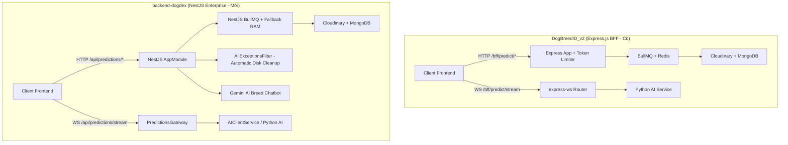

# Báo Cáo So Sánh Kiến Trúc & Quyết Định Chiến Lược: `DogBreedID_v2` vs `backend-dogdex`

Báo cáo phân tích so sánh toàn diện và lưu trữ các **Quyết định Chiến lược (Architectural & Business Decisions)** cho dự án mới `backend-dogdex`.

---

## 1. Quyết Định Định Hướng Kinh Doanh & Kiến Trúc (Core Decisions)

> [!IMPORTANT]
> 1. **BỎ HOÀN TOÀN HỆ THỐNG TOKEN (Token System Removal)**:
>    - Dự án mới `backend-dogdex` chủ động **loại bỏ hoàn bộ hệ thống trừ điểm/Token** phức tạp của v2 cũ (`tokenLimiter`).
>    - Thay thế bằng cơ chế `@Throttle()` rate limiting tiêu chuẩn để bảo vệ hệ thống khỏi spam.
> 
> 2. **CHUYỂN HƯỚNG MÔ HÌNH KINH DOANH (Monetization Pivot)**:
>    - Chuyển từ hình thức thu phí Token lượt dùng AI sang mô hình kinh doanh bán sản phẩm vật lý: **Vòng cổ thông minh (Smart Collar)** và **Thẻ mã QR định danh thú cưng (Pet QR Tag Identification)** (`/products`, `/pet/[tagId]`).
> 
> 3. **CẬP NHẬT CHATBOT AI GEMINI**:
>    - Đã port và tích hợp chính thức route **Gemini AI Breed Chatbot** vào `backend-dogdex`:
>      - `POST /api/predictions/chat/:breedSlug`: Trò chuyện tư vấn AI về giống chó.
>      - `GET /api/predictions/chat/:breedSlug/history`: Lấy lịch sử chat từ Redis.
> 
> 4. **BACKLOG TÍNH NĂNG TIẾP THEO (Roadmap Backlog)**:
>    - Đã ghi nhận 2 route gợi ý vào Backlog phát triển tiếp theo:
>      - `GET /api/predictions/:breedSlug/health-recommendations`
>      - `GET /api/predictions/:breedSlug/recommended-products`

---

## 2. Phân Tích Kiến Trúc Tổng Quan

---

## 3. Bảng So Sánh Chi Tiết & Trade-Offs

| Tiêu Chí Phân Tích | `DogBreedID_v2` (Express.js) | `backend-dogdex` (NestJS) | Đánh Giá & Trade-Offs |
| :--- | :--- | :--- | :--- |
| **Mô hình Kinh doanh** | Bán & trừ điểm Token theo từng lượt dùng AI (Predict/Chat). | **Chuyển hướng bán Sản phẩm Vật lý**: Vòng cổ chó & Thẻ mã QR định danh (`/pet/[tagId]`). Bỏ hẳn Token, chỉ dùng `@Throttle()` Rate Limit. | **Đánh giá**: Mô hình bán phần cứng/QR tag bền vững và trực quan hơn cho người nuôi thú cưng. |
| **Tính năng Gemini ChatBot** | Route `/bff/predict/chat/:breedSlug` + Redis History. | **Đã port chính thức**: `POST /api/predictions/chat/:breedSlug` & `GET /api/predictions/chat/:breedSlug/history`. | **Đánh giá**: Hoàn thành đồng bộ tính năng tư vấn AI theo giống chó. |
| **Quản lý Tệp đệm Local** | Dọn dẹp tệp `public/uploads` thủ công bằng khối `finally` trong từng handler. | **Tự động hóa hoàn toàn**: • Dọn dẹp trong worker queue. • `AllExceptionsFilter` tự động bẫy mọi lỗi HTTP (400, 401, 500) và xóa tệp đệm đĩa ngay. | **Ưu điểm NestJS**: Triệt tiêu hoàn toàn rủi ro bị đầy dung lượng đĩa do tệp đệm rác. |
| **Live Camera WebSocket** | Dùng thư viện `express-ws`. Trực tiếp proxy luồng tới AI Service. | Dùng `@nestjs/platform-ws` đóng gói thành `PredictionsGateway` trên `/api/predictions/stream`. | **Ưu điểm NestJS**: Đóng gói mượt mà thành Gateway class, độ trễ cực thấp cho camera. |
| **Đường dẫn API** | Dùng tiền tố `/bff/predict/...` | Chuẩn hóa tiền tố **/api/predictions/...** (Hỗ trợ đầy đủ Route Alias tương thích `v2`). | **Ưu điểm NestJS**: Đúng chuẩn Enterprise REST API (`/api/v1/...`). |

---

## 4. Danh Sách Công Việc Backlog (Sprint Tiếp Theo)

- [ ] `GET /api/predictions/:breedSlug/health-recommendations`: Tự động tổng hợp lời khuyên sức khỏe cho giống chó từ AI & Cache Redis.
- [ ] `GET /api/predictions/:breedSlug/recommended-products`: Tự động gợi ý danh sách phụ kiện, thức ăn phù hợp theo giống chó từ Catalog Sản phẩm.
